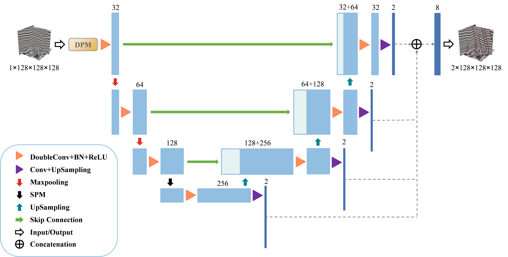

# SeisUNet:3D Seismic Fault Segmentation Using a Customized U-Net




## Requirement
- python 3.8
- pytorch 1.8.1
- pandas==1.3.5 
- torchsummary==1.5.1 
- scikit-learn==0.24.2 
- openpyxl==3.0.10

## DataSet
```commandline
data/
│
├── train/
│   ├── x/
│   │   └── 0.npy
│   └── y/
│       └── 1.npy
└── valid/
    ├── x/
    │   └── 0.npy
    └── y/
        └── 1.npy
```

## Train
```angular2html
python main.py --mode [train] --model_type [LP_P3_SO] --exp [EXP_NAME] --epochs [epochs_number] --train_path [train_path] --valid_path [valid_path]  --in_channels [1 or 3]
```

## Valid_only
```angular2html
python main.py --mode [valid_only] --model_type [LP_P3_SO] --exp [EXP_NAME] --valid_path [valid_path]  --in_channels [1 or 3]
```

## Prediction
```angular2html
python main.py --mode [pred] --model_type [LP_P3_SO] --exp [EXP_NAME] --in_channels [1 or 3] --pred_data_name f3
```

## Fault Segmentation Result of F3

